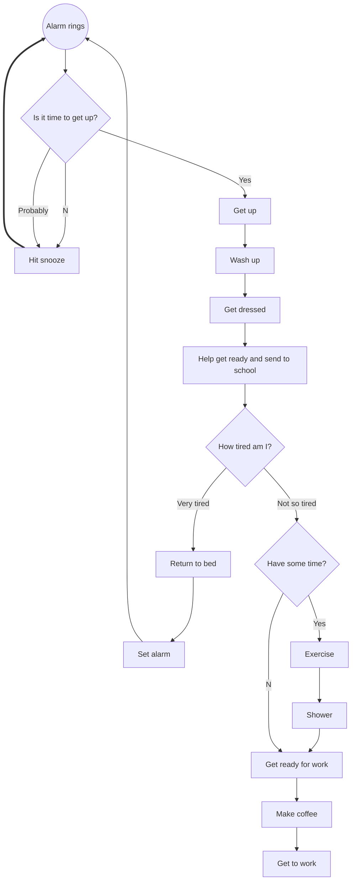

# Mermaid Morning Routine

```mermaid
   flowchart TD
   A((Alarm rings))-->B{Is it time to get up?};
   B--No-->C[Hit snooze];
   B--Probably-->C[Hit snooze];
   B--Yes-->D[Get up];
   C==>A;
   D-->E[Wash up];
   E-->F[Get dressed];
   F-->G[Help get ready and send to school];
   G-->H{How tired am I?};
   H--Very tired-->I[Return to bed];
   I-->J[Set alarm];
   J-->A;
   H--Not so tired-->K{Have some time?};
   K--Yes-->L[Exercise];
   L-->M[Shower];
   M-->N[Get ready for work];
   K--No-->N;
   N-->O[Make coffee];
   O-->P[Get to work]
```
